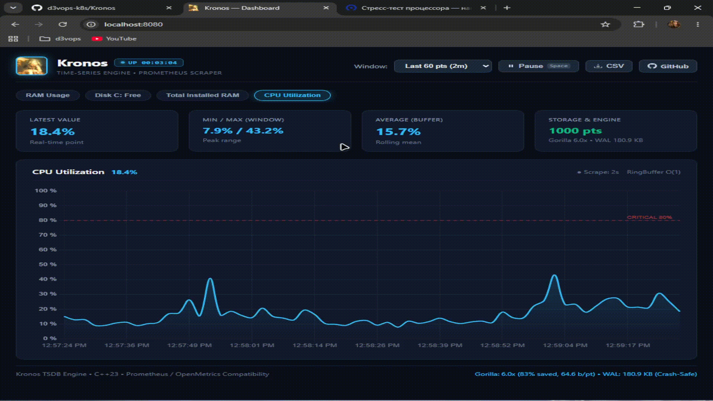

# ⏱️ Kronos TSDB

> A single-binary Time-Series Database written in **C++23** from scratch. Prometheus-compatible scraping, WAL crash-recovery, and Facebook Gorilla compression packed into a 9 MB executable.

<p align="center">
  
</p>

---

## What is this?

A lightweight TSDB engine built to explore how time-series databases actually work under the hood — without third-party frameworks, external databases, or runtime dependencies.

* **Single Executable:** Web UI, background scraper, storage engine, and query API compiled into one static binary.
* **No OOM by Design:** Time series live in fixed-capacity ring buffers with $O(1)$ modulo wrap-around eviction.
* **Crash-Safe:** Append-only Write-Ahead Log (WAL) with binary encoding and header validation. Survives crashes without losing points.
* **Gorilla Compression:** Delta-of-Delta timestamp encoding + floating-point XOR bit packing. Compresses telemetry by **9.4x**.
* **Zero-Copy Parser:** Custom OpenMetrics text parser using `std::string_view` and `std::from_chars` (< 50ns per metric).

---

## ⚡ Quick Start

```powershell
# Build (requires GCC 16+ / Clang 18+ and Ninja)
cmake -B build -G "Ninja" -DCMAKE_BUILD_TYPE=Release
cmake --build build

# Terminal 1: Run sample metrics generator
.\build\mock_exporter.exe

# Terminal 2: Run Kronos daemon
.\build\kronos.exe
```

Open **`http://localhost:8080`** to see real-time streaming telemetry.

---

## 📊 Gorilla Compression Benchmark

Compression test on 10,000 real-world metric points (`node_cpu_seconds_total`, 2s scrape interval):

```
Total points processed : 10,000
Raw data size          : 160,000 bytes (156.25 KB)
Gorilla compressed size:  17,023 bytes ( 16.62 KB)
Compression Ratio      : 9.40x (saved 89.4%)
Bits per point         : 13.62 bits (down from 128 bits)

Throughput             : 13,140,604 points/sec (761 µs total)
Lossless Accuracy      : 100% exact match (0.0000% error)
```

---

## 🏗️ Architecture

```
[ Target Exporter (:9100) ]
        │  HTTP GET
        ▼
[ Background Scraper ]   ── std::jthread (cooperative stop_token)
        │  string_view zero-copy
        ▼
[ OpenMetrics Parser ]   ── std::from_chars (zero heap allocs)
        │
        ▼
[ ThreadSafeStorage ]    ── std::shared_mutex (RWLock)
   ├── RingBuffer        ── O(1) circular memory
   └── WAL Engine        ── Binary append-only log on disk ('KR' magic header)
        │
        ▼
[ Embedded HTTP Server ] ── REST API (:8080)
        │
        ▼
[ Live Dashboard ]       ── Embedded single-page Chart.js UI (dark theme)
```

---

## 🔌 API

* `GET /` — Embedded live dashboard
* `GET /health` — Liveness probe (`{"status":"ok"}`)
* `GET /api/v1/metrics_list` — Array of registered metrics
* `GET /api/v1/query?name=<metric>` — Timeseries points, latest value, and rolling average
