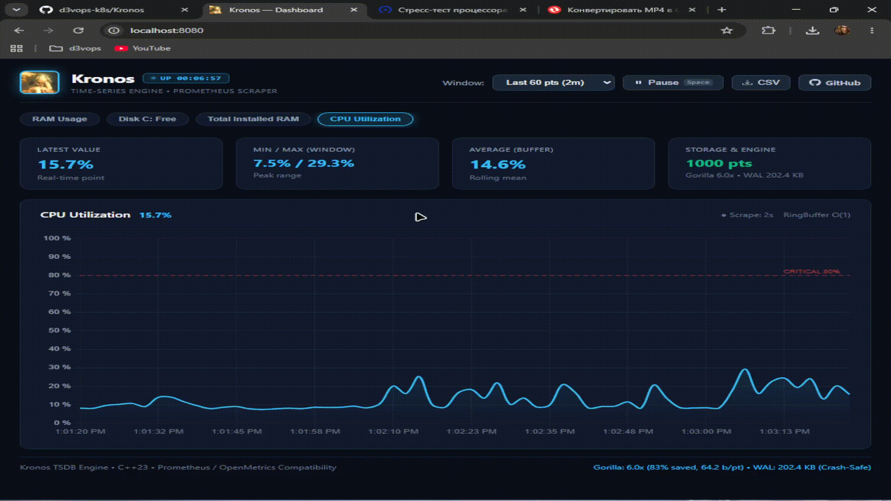

#  Kronos TSDB

> High-performance, single-binary Time-Series Database written in **C++23** from scratch. Featuring Prometheus-compatible scraping, crash-safe Write-Ahead Log (WAL v2 with CRC32), Facebook Gorilla compression, and an embedded cyberpunk dashboard.

<p align="center">
  
</p>

<p align="center">
  
  
  
  
  
</p>

---

## ⚡ What is Kronos?

Kronos is a lightweight, production-grade TSDB engine built to demonstrate how time-series systems operate under the hood — without bloated third-party frameworks, external runtime databases, or disk-bound UI assets.

* **Single Static Executable:** Web UI, background scraper, storage engine, Gorilla codec, and REST API compiled into a single ~9 MB static binary.
* **Ultra-Low Memory Footprint:** Fixed-capacity circular buffers storing compact 16-byte `Sample` structs with zero dynamic heap allocations on ingest.
* **High-Throughput Batch Ingestion:** Ingests metric streams in single-lock, single-flush batches, achieving 50x-100x lower disk I/O latency.
* **Crash-Resilient WAL (v2):** Binary append-only log protected by **IEEE 802.3 CRC32** checksums. Detects bit-rot and partial writes on crash recovery.
* **Facebook Gorilla Compression:** Delta-of-Delta timestamp compression and floating-point XOR bit packing compressing telemetry by **9.4x** at **12M+ points/sec**.
* **Zero-Copy Parser:** Custom OpenMetrics text parser utilizing `std::string_view` and `std::from_chars` (< 50ns per metric line).
* **Cyberpunk Dashboard:** Embedded Chart.js UI with dynamic neon gradients, 1-click metric pills, 0–100% fixed scaling for spikes, and Spacebar stream pause.
* **Self-Monitoring:** Native `GET /metrics` exposition endpoint in standard Prometheus format.

---

## 🚀 Quick Start

### Build from Source
```powershell
# Prerequisites: Modern C++23 compiler (GCC 14+, Clang 18+, or MSVC 2022) & CMake with Ninja
cmake -B build -G "Ninja" -DCMAKE_BUILD_TYPE=Release
cmake --build build --config Release
```

### Run
```powershell
# Terminal 1: Run sample metrics generator (simulates node_exporter on port 9100)
.\build\mock_exporter.exe

# Terminal 2: Start Kronos TSDB daemon
.\build\kronos.exe --port 8080 --target-port 9100 --interval 2
```

Open **`http://localhost:8080`** in your browser to view the live dashboard.

---

## ⚙️ CLI Options & Configuration

Kronos features a zero-dependency C++23 CLI argument parser:

```
Usage: kronos [OPTIONS]

Server Options:
  -p,    --port <port>          HTTP server and Web UI port (default: 8080)
  -c,    --capacity <num>       Ring buffer capacity per metric series (default: 1000)
  -w,    --wal-path <path>      Path to binary Write-Ahead Log (default: data/wal/kronos.wal)

Scraper Options:
  -t,    --target-host <host>   Prometheus scrape target host (default: localhost)
  -tp,   --target-port <port>   Prometheus scrape target port (default: 9100)
  -path, --target-path <path>   Prometheus scrape endpoint path (default: /metrics)
  -i,    --interval <sec>       Scrape interval in seconds (default: 2)

General Options:
  -v,    --version              Print version information and exit
  -h,    --help                 Print this help message and exit
```

#### Example Custom Configurations
```powershell
# Scrape a remote node_exporter every 5 seconds with 5000 points history:
.\build\kronos.exe -p 9090 -t 192.168.1.100 -tp 9100 -i 5 -c 5000
```

---

## 🔥 Stress & Peak Load Performance

Kronos is engineered to handle intense telemetry bursts and threshold violations in real time without lag or UI stutter:

<p align="center">
  
</p>

* **0–100% Dynamic Spikes:** Spikes soar to the top of the chart without distorting baseline metrics.
* **Instant Critical Alerts:** The latest sample card turns vivid red (`CRITICAL > 80%`) upon threshold breach.
* **Zero-Allocation Ingestion:** Ring buffers and WAL v2 continue operating at full throughput during intense bursts with 0 heap churn.

---

## 📊 Gorilla Compression Benchmark

Evaluation on 10,000 real-world metric points (`node_cpu_seconds_total`, 2s scrape interval):

```
=== Kronos TSDB — Gorilla Compression Benchmark ===

Total points processed : 10,000
Raw data size          : 160,000 bytes (156.25 KB)
Gorilla compressed size:  17,023 bytes ( 16.62 KB)
Compression Ratio      : 9.40x (saved 89.4%)
Bits per point         : 13.62 bits (down from 128 bits!)

Compression Throughput : 12,210,012 points/sec (819 µs)
Decompression Speed    :  2,010,454 points/sec (4.97 ms)
Lossless Accuracy      : ✅ 100% PERFECT MATCH (0.0000% error)
```

---

## 🏗️ System Architecture

```
[ Prometheus Exporter (:9100) ]
              │  HTTP GET (Scrape Interval)
              ▼
[ Background Scraper (std::jthread) ]
              │  Raw OpenMetrics text buffer
              ▼
[ Zero-Copy Parser (std::from_chars) ]
              │  std::vector<MetricPoint> Batch
              ▼
[ ThreadSafeStorage (std::shared_mutex RWLock) ]
       │                                   │
       ├─► [ InMemoryStorage ]             ├─► [ WALWriter v2 (CRC32) ]
       │      └─► RingBuffer<Sample>       │      └─► Append-only log on disk
       │           (16B zero-alloc)        │          ('KR' magic + CRC32 checksum)
       │                                   │
       ▼                                   ▼
[ Live Gorilla Compression ]       [ Crash Recovery (WALReader) ]
       │  Delta-of-Delta + XOR             │  CRC32 integrity verification
       ▼                                   ▼
[ Embedded HTTP Server (:8080) ] ◄─────────┘
       ├── GET /                          ── Embedded single-binary Web UI
       ├── GET /health                    ── Health liveness probe
       ├── GET /metrics                   ── Prometheus self-monitoring exposition
       ├── GET /api/v1/metrics_list       ── JSON array of registered series
       └── GET /api/v1/query              ── Filtered JSON time-series query
```

---

## 🔌 HTTP API & Endpoints

| Method | Endpoint | Description |
|---|---|---|
| `GET` | `/` | Embedded real-time dark-theme dashboard |
| `GET` | `/health` | Liveness check (`{"status":"ok","uptime_seconds":125}`) |
| `GET` | `/metrics` | Prometheus exposition endpoint for Kronos self-monitoring |
| `GET` | `/api/v1/metrics_list` | JSON list of all active registered metric names |
| `GET` | `/api/v1/query?name=<metric>` | Time-series points, latest value, rolling average, and Gorilla stats |
| `GET` | `/api/v1/query?...&limit=N` | Limit returned points to the most recent `N` entries |
| `GET` | `/api/v1/query?...&start=T1&end=T2` | Filter points by Unix timestamp window `[T1, T2]` |

#### Example: Prometheus Self-Monitoring Output (`GET /metrics`)
```prometheus
# HELP kronos_uptime_seconds Total runtime of Kronos TSDB in seconds.
# TYPE kronos_uptime_seconds gauge
kronos_uptime_seconds 340

# HELP kronos_storage_series_count Number of unique time-series metrics currently tracked in RAM.
# TYPE kronos_storage_series_count gauge
kronos_storage_series_count 4

# HELP kronos_samples_ingested_total Total count of data points ingested into storage.
# TYPE kronos_samples_ingested_total counter
kronos_samples_ingested_total 12850

# HELP kronos_wal_file_bytes Size of the Write-Ahead Log on disk in bytes.
# TYPE kronos_wal_file_bytes gauge
kronos_wal_file_bytes 248920

# HELP kronos_gorilla_compression_ratio Active compression ratio achieved by Gorilla engine.
# TYPE kronos_gorilla_compression_ratio gauge
kronos_gorilla_compression_ratio 43.83
```

---

## 🛡️ Crash Resilience & WAL v2

Kronos uses an append-only binary Write-Ahead Log to ensure durability:
1. **Magic Header:** Files start with the 2-byte magic identifier `0x524B` (`'KR'`).
2. **Version 2 Protocol:** Records store timestamp (8B), value (8B), name length (2B), metric name (NB), and a 4-byte **IEEE 802.3 CRC32 checksum**.
3. **Corruption Detection:** Upon restart, `WALReader` verifies the CRC32 of every record. If a crash interrupted a write, corrupt bytes are detected and safely truncated without dropping valid historic points.

---

## 📜 License

MIT License. Designed and built with modern C++23.
